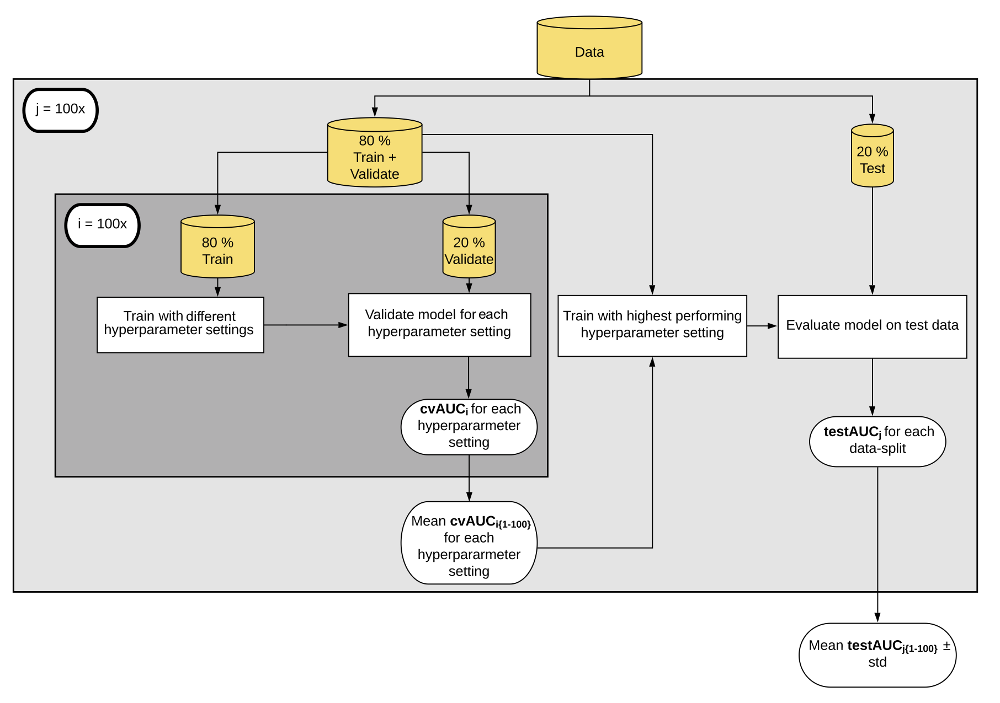

# Predict colorectal cancer using microbiome data

Our goal is to try to predict whether someone has colorectal cancer based on the abundance of different bacteria in their stool microbiome.

__Feaures:__ 16S rRNA gene abundances clustered to OTUs (represent bacterial abundances)

__Label:__ Health outcome (whether the patient has colorectal cancer or not)

__Classification algorithm:__ Logistic Regression

- Data from: https://github.com/SchlossLab/Sze_CRCMetaAnalysis_mBio_2018
- ML pipeline modified from: https://github.com/SchlossLab/mikRopML
- Further reading on this project: https://mbio.asm.org/content/11/3/e00434-20
**Credit:** Thank you **Zena Lapp** for your live-coding scripts. 

1. First thing we do is download the dataset: There are 2 ways of doing this:

      - Clone this repository on your terminal in Mac or Git Bash on Windows if you have it.

__3. Open RStudio.__ Go to `File` tab, click on `New Project`, create a project on `Existing Directory`, navigate to `machine-learninig-pipelines-r` directory and start the new project. Now you can open a New R script clicking on the green plus in RStudio. 

__4. First we will load packages.__ If you haven't installed the packages before, please go to your RStudio console:
  
  ```install.packages('caret')```

If you already installed these all you have to type  now is:

  ```
  library(caret)
  ```

__5. We are now ready to read in our data.__

```
data = read.delim('../data/data.tsv')
```

__6. Explore the data:__

```
> data[1:5,1:5]

  cancer   Otu00001   Otu00002    Otu00003     Otu00004
1      0 0.09804447 0.06288435 0.076198630 0.0033046927
2      0 0.05759443 0.03689744 0.074058219 0.0148711170
3      1 0.10072328 0.21027574 0.319777397 0.0003304693
4      0 0.08893651 0.13013291 0.488869863 0.0000000000
5      1 0.45459416 0.00178536 0.008561644 0.0006609385
```

__7. Learn about the data:__

- The rows are different samples, each from a different person
- The first column is whether the person has cancer or not
    - 0 means no cancer, 1 means cancer
    - This is the **label**
- The rest of the columns are abundance of different OTUs
    - OTU stands for operational taxonomic unit, which is kind of like a species
    - Scaled to be between 0 and 1
    - These are the **features** we will use to classify/predict the label
  
How many samples do we have? How many features?

```
table(data$cancer)

 0   1 
172 120 
```

__8. Do we have any missing data?__

```
sum(is.na(data))
[1] 0
```
Since we don't have any missing data, we don't have to remove any of the samples. 

__9. Refactor parts of the data__

We need to change the numeric outcomes to a string. Caret doesn't like having numeric outcome variables. 
  
```
data$cancer <- ifelse(data$cancer == 1, "cancer", "normal")
```

__10. Split data into train and test set:__

The next step is to split the data into a training set (80% of the data) and a test set (20% of the data). We will make a random forest model using the training set and then test the model using the test set.

Why are we doing this? Because to have a reliable model, we need to follow the ML pipeline seen in Figure 1.



We need to have a held-out test data, that will not be used for training the model. To create a training dataset and a held-out test dataset we need to make changes to our dataset. 

   - Randomly order samples. 
   ```
   random_ordered <- data[sample(nrow(data)),]
   ```

   - Determine the number of training samples
   ```
  number_training_samples <- ceiling(nrow(random_ordered) * 0.8)
  ```
  
   - Create training set:
   ```
   train <- random_ordered[1:number_training_samples,]
   ```

  - Create testing set
  ```
  test <- random_ordered[(number_training_samples + 1):nrow(random_ordered),]
  ```
 
 

 Let's look at the `caret` package which is a helpful wrapper that makes our life easier!

 `Caret` package is short for Classification And REgression Training) is a set of functions that attempt to streamline the process for creating predictive models. The package contains tools for all the steps of machine learning. 

__11. Load the caret package:__

 ```
 library(caret)
```

__12.__ The syntax for training `caret` models is a little different than what we used before. Because we can use many different models here, they created a generic `train` function. We define what the training `data` is, then the `method` as random forest. We also define which `metric` we want to use to evaluate the model. You can look at what options you have with caret here: http://topepo.github.io/caret/index.html.

We also choose to do a better job with out pipeline by adding a cross-validation step to our training step. 

- Let's create a cross-validation scheme. This is an internal data-split to create a better model where we test different `mtry` parameters and decide which one is better.
      
- How many folds will there be in our cross-validation step? If we pick `5` then 80% of the data will be used to train and 20% will be used to test different `mtry` options. This will be repeated until each fold is tested. (This is an internal datasplit which is applied after the first outer datasplit to create held-out dataset)
      
      ```
      cv <- trainControl(method="cv", number=5)
      ```
      - What `mtry` options are we trying in cross-validation?
      
      ```
      grid <-  expand.grid(cost = c(10, 1, 0.1, 0.01, 0.001),
                           loss = "L2_primal",
                           epsilon = 0.01)
      ```
      - Let's train the model:

      ```
      trained_model <-  train(cancer ~ .,
                        data=train,
                        method = "regLogistic",
                        metric = "Accuracy",
                        tuneGrid = grid,
                        trControl = cv,
                        returnResamp="final") 
      ```
4. Our model is trained and we can see how each `cost` hyperparameter did. 

```
trained_model
```


5. Now we have the trained model and our model picked the best `mtry` to use, let's predict on test set.
```
logit_pred <- predict(trained_model, test)
```
6. Let's see how the model did. We can use the `confusionMatrix` function in the `caret` package.
```
confusionMatrix(logit_pred, as.factor(test$cancer))
```

```
Confusion Matrix and Statistics

          Reference
Prediction cancer normal
    cancer     10      1
    normal     13     34
                                          
               Accuracy : 0.7586          
                 95% CI : (0.6283, 0.8613)
    No Information Rate : 0.6034          
    P-Value [Acc > NIR] : 0.009653        
                                          
                  Kappa : 0.4461          
 Mcnemar's Test P-Value : 0.003283        
                                          
            Sensitivity : 0.4348          
            Specificity : 0.9714          
         Pos Pred Value : 0.9091          
         Neg Pred Value : 0.7234          
             Prevalence : 0.3966          
         Detection Rate : 0.1724          
   Detection Prevalence : 0.1897          
      Balanced Accuracy : 0.7031          
                                          
       'Positive' Class : cancer
```

  
